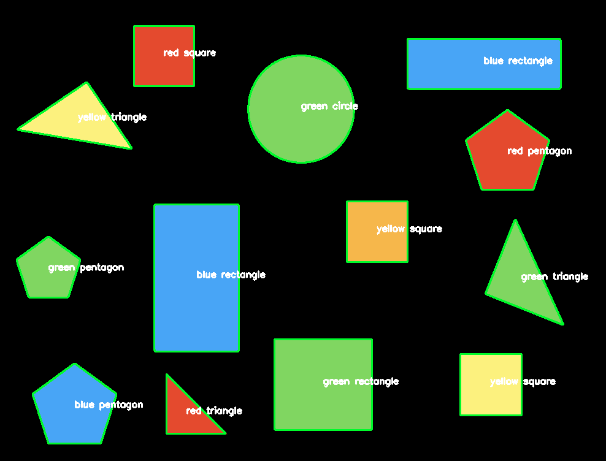

# OPENCV BOOK

In this folder is many tutorials for OpenCV. Recommend to take a look.

# PRACTICAL CASES

In practical cases I am learning and dealing with practical cases with OpenCV such as:
- amazon cover search
- eye tracking
- face detection
- recognizing handwritten text
- object detection or plant classification

# CENTER OF CONTOUR

goal: How do I compute the center of a contour using Python and OpenCV?

1) detect the outline of each shape in the image
2) compute the center of the contour — also called the centroid of the region

image preprocessing:
1) Conversion to grayscale
2) Blurring to reduce high frequency noise to make contour detection more accurate
3) Binarization of the image (thresholding)

# SHAPE & COLOR DETECTION

This code is built on previos (center of contour) but here I also add something more.
Algorithm is able to recognize shape and also color.

Detect shape:
1) Using Dougles-Peucker algorithm
2) peri = cv2.arcLength(contour, True)
3) approx = cv2.approxPolyDP(contour, 0.04*peri, True)
4) IF/ELSE based on number of detected lines (circle, triangle, square...)

# TEXT CORRECTION

goal: find text and then rotate it to right - horizontal position for reading

1) Load image -> resize -> change colors into Gray
2) Bitwise_not -> background black, text white
3) Threshold (pixels will be just black and white)
4) Find coordinates and angle with: cv2.minAreaRect
5) Rotate image into horizontal position with: warpAffine based on: cv2.getRotationMatrix2D

