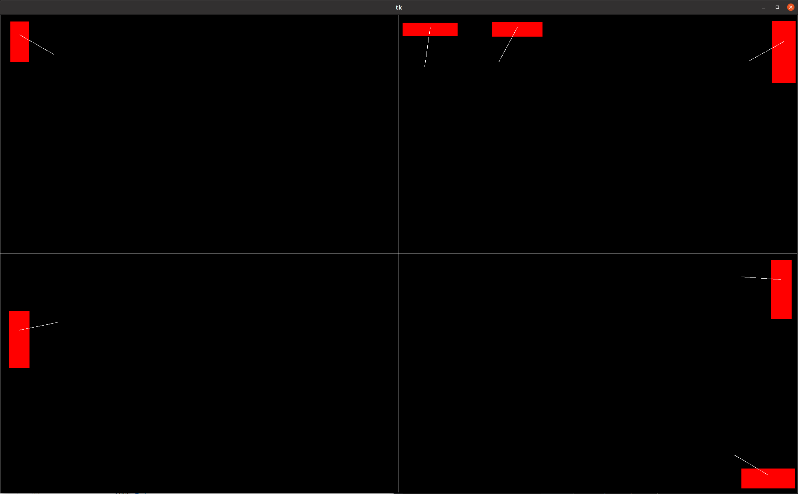

# MIXING

**Code** - [draw_rectangles.py](https://github.com/timothyvanco/computer_vision/blob/master/box_mydlo/draw_rectangles.py)

Purpose of this code is to visualize box, where user can draw rectangles which are "objects from real world". In our task, we are drawing rectangles as substitution for soap. Then algorithm compute center of box and center of rectangle/soap and find coordinates of vector, which can be used as input parameters for Robotic hand/Robot - which will move object/rectangle/soap from his centre into to box with direction to his center. Visualization of this can be seen on picture below.

User has also option of creating box in a size as he wants it. Algorithm asks him in the beginning.

