# Basic Image Operations

## ARITHMETIC
Image arithmetics - increasing and decreasing values of pixels. 
In result you can see - original image, image to which was added matrix with values of 100, 
and image from which was subtracted matrix with values of 50.
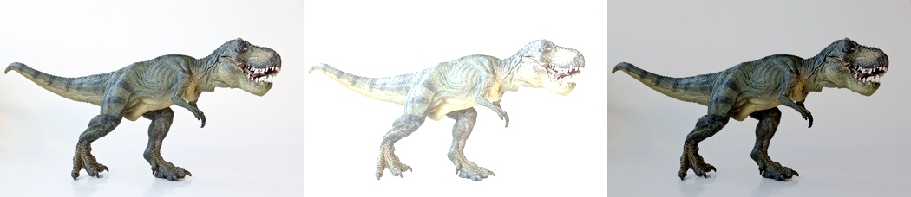

## BITWISE OPERATION
Bitwise operation such as - AND, OR, XOR and NOT.
Working with each pixel. Results:
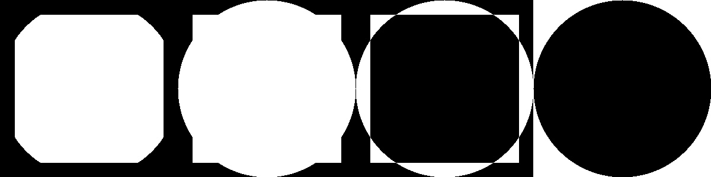

This can be used, when you dont care about other part of an image, 
but just some special area in image recognition (face, hand...)

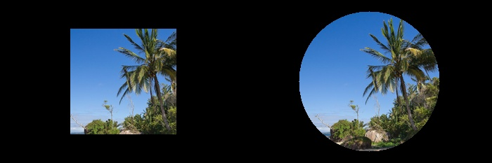

## BLURRING

### AVERAGING
Define a k × k sliding window on top of our image, where k is always an odd number. 
This window is going to slide from left-to-right and from top-to-bottom. 
The pixel at the center of this ma- trix (we have to use an odd number, 
otherwise there would not be a true “center”) is then set to be the average of all other pixels surrounding it.

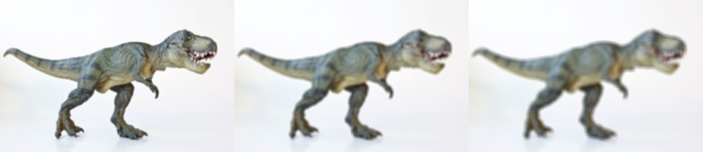

### GAUSSIAN
Gaussian blurring is similar to average blurring, but instead of using a simple mean, 
we are now using a weighted mean, where neighborhood pixels that are closer to the central 
pixel contribute more “weight” to the average.

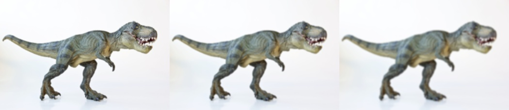

### MEDIAN
By definition, the median pixel must exist in our neighborhood. 
By replacing our central pixel with a median rather than an average, we can substantially reduce noise.

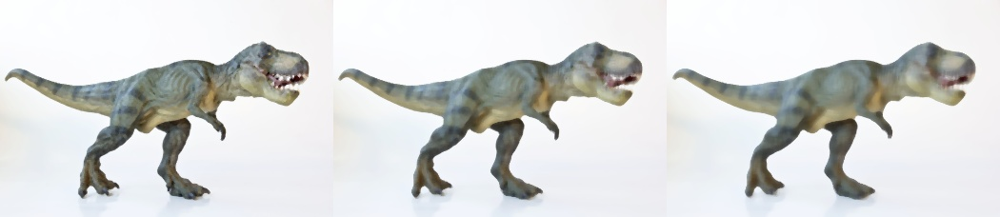

### BILATERAL
In order to reduce noise while still maintaining edges, 
we can use bilateral blurring. Bilateral blurring accomplishes this 
by introducing two Gaussian distributions.
this method is able to preserve edges of an image, while still reducing noise. 
The largest downside to this method is that it is considerably slower than its averaging, 
Gaussian, and median blurring counterparts.

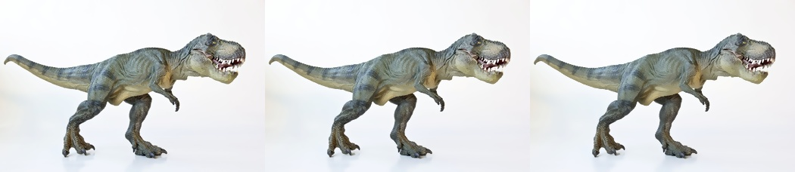

## COUNTING COINS

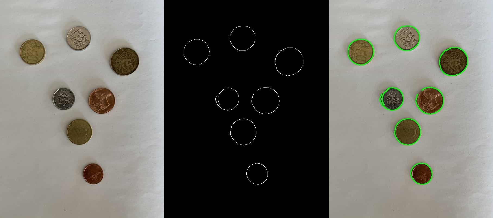

## CROP
Crop out part of an image.

## DRAWING
Draw line, rectangle (with thickness of a line and full of color).
Draw a circles which have bigger radius from center.
Draw a circles with random radius and random colors.

AND - if both pixels greater than zero

OR - if one of pixels is greater than zero 

XOR - if one of pixels is greater than zero but not both

NOT - inverts "on" and "off" pixels
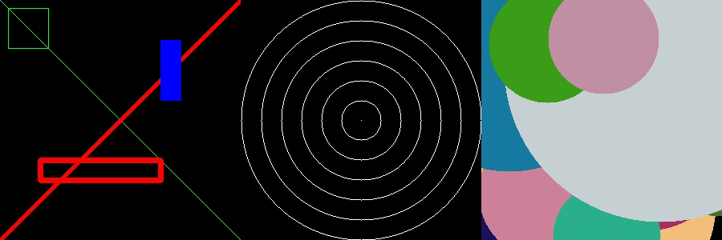

## FLIPPING
Original image, flipped image in horizontal, flipped image in vertical, 
flipped image in horizontal and vertical.
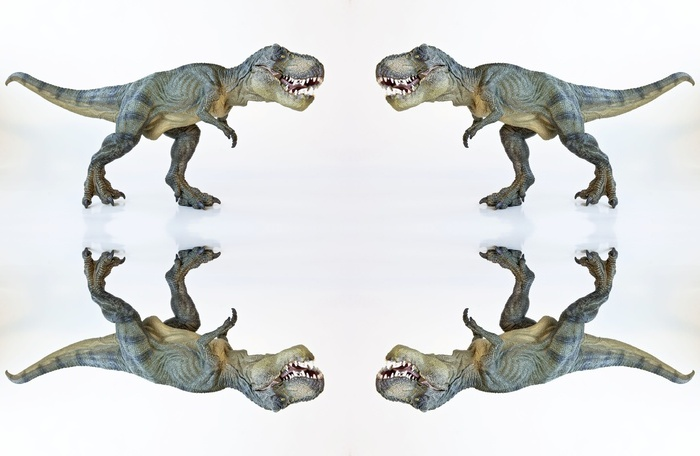

## GRADIENTS and EDGE DETECTION
Edge detection embodies mathematical methods to find points 
in an image where the brightness of pixel intensities changes distinctly.

RESULT: Original, Sobel X-axis, Sobel Y-axis, bitwise OR
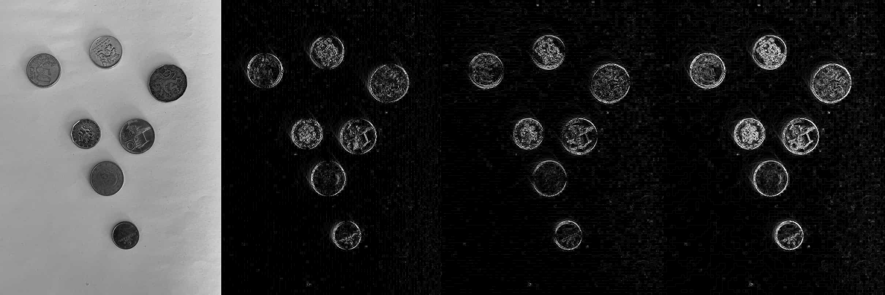

In edge detenction I also used canny function.

canny = cv2.Canny(image, 30, 150)

image - input image

threshold1 - value below this considered non-edges

threshold2 - value above this considered edges

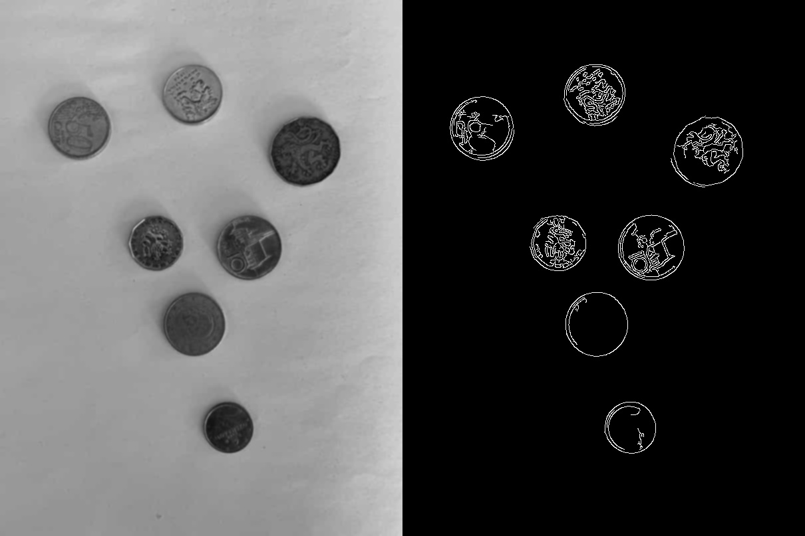

## HISTOGRAM
Represents the distribution of a pixel intensities (color or grayscale)
in an image. Can be visualized in a graph or plot. 

X - axis is a "bins" - we have 1256 bins (0 - 255) values of pixel.

Y - axis is number of pixels of a given value

By simply examining the histogram of an image, you get a general understanding
regarding the constrast, brightness and intensity distribution.
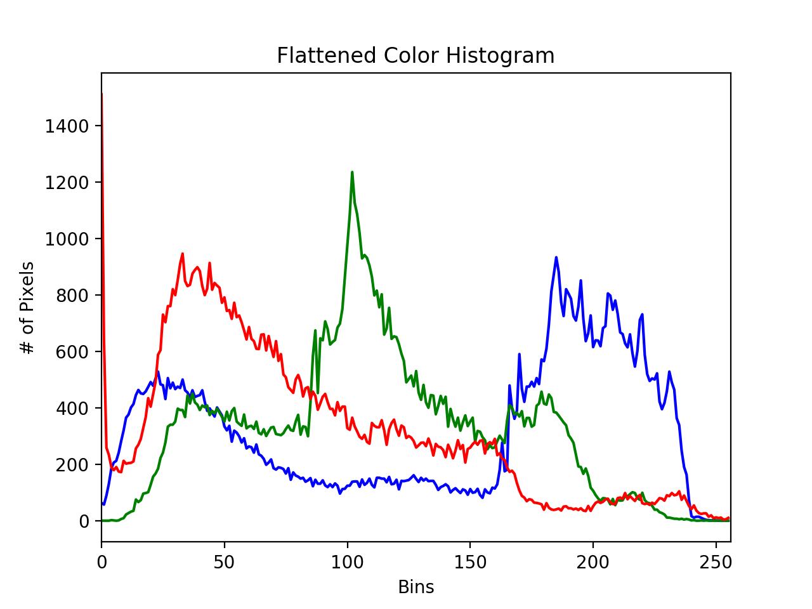

## HISTOGRAM EQUALIZATION
Improves contrast of an image by stretching distribution of pixels.
Consider histogram with large peak at the center. Applying histogram
equalization will stretch the peak out towards the corner of the image.
Improving global contrast of image.

Usage - enhancing contrast of medical or satellite images

Result: left - gray image, right - equalized image

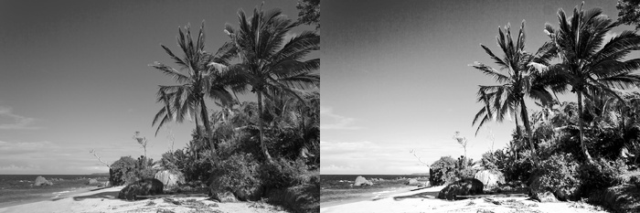

## IMUTILS
File in which are functions, which make resize, rotate etc. much simpler.

### SPLITTIN & MERGING
Every RGB picture has 3 values - red, green and blue. 
In splitting - I am taking every channel out of the picture,
so I want to extract R G B channels and then show their values.
In a result, you can see a beach. For example sky is normally blue
so in first picture, which is visualizing RED values - they are almost
dark, because of values near a zero. On the other hand,
most right picture for BLUE channel, has blue values almost at 255 value. Logically.

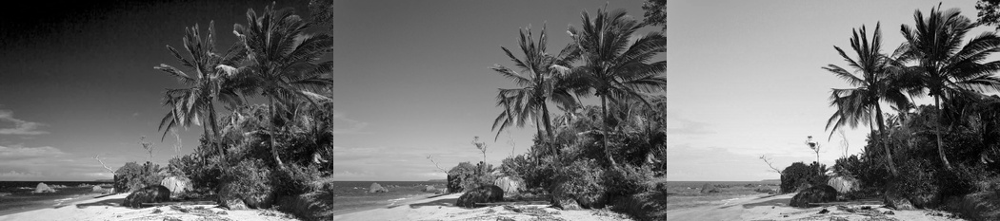

## RESIZE
Make a picture bigger or smaller base on ratio.

## ROTATION
Rotate image based on angle.

## TRANSLATION
How should be image shifted - right, left, up, down.

## THRESHOLDING
Thresholding is the binarization of an image.
In general, we seek to convert a grayscale image to a binary image,
where the pixels are either 0 or 255.

A simple thresholding example would be selecting a pixel value p,
and then setting all pixel intensities less than p to zero,
and all pixel values greater than p to 255.

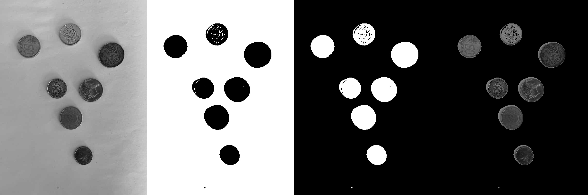

### ADAPTIVE THRESHOLDING

Having just one value of T might not suffice.
In order to overcome this problem, we can use adaptive thresholding, 
which considers small neighbors of pixels and then finds an optimal 
threshold value T for each neighbor. This method allows us to handle 
cases where there may be dramatic ranges of pixel intensities and the 
optimal value of T may change for different parts of the image.

The most important parameters to vary are the neighborhood size and C, 
the value you subtract from the mean. By experimenting with this value, 
you will be able to dramatically change the results of your thresholding.

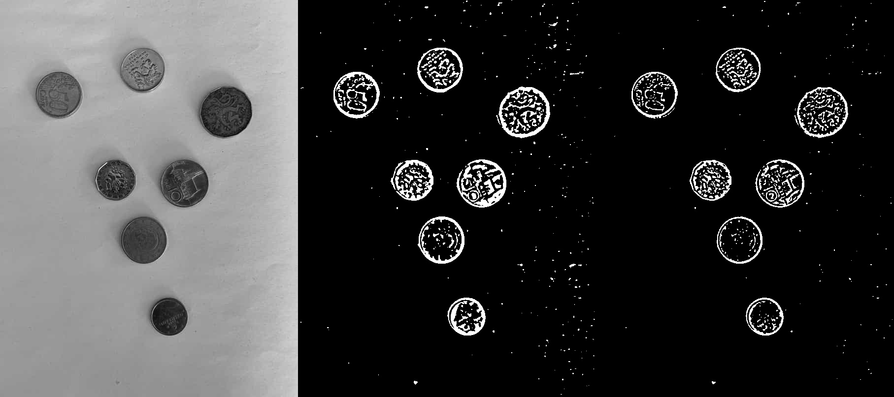

### OTSU and RIDDLER-CALVARD
Otsu’s method assumes there are two peaks in the grayscale histogram 
of the image. It then tries to find an optimal value to separate these 
two peaks – thus our value of T.

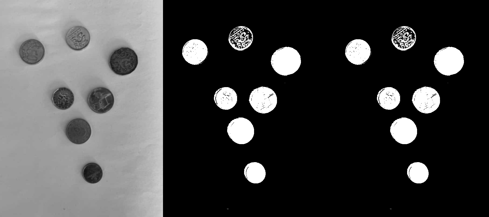

