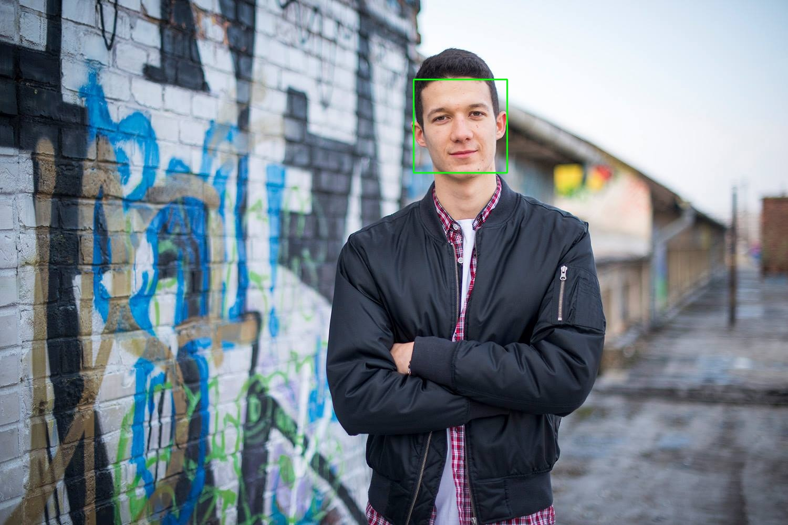
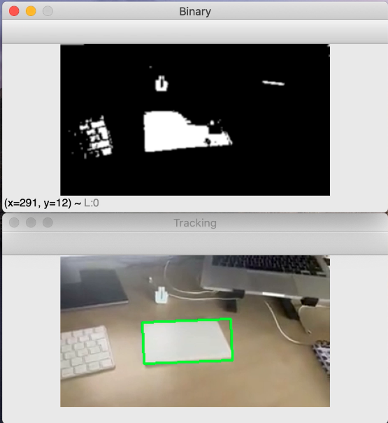
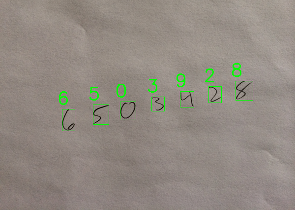
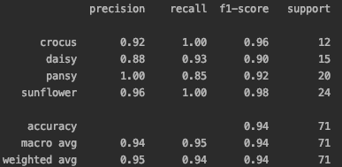

## FACE DETECTION

<<<<<<< HEAD
I am using pre-trained HAAR cascades classifier in XML.
=======
I am using pre-trained Haar cascades classifier in XML.
>>>>>>> f8b2573345e2d3cee7c0dddeccc29a5baccc7906

Haar cascades are all called Viola-Jones detectors, 
named after the researchers who first introduced 
the method in their 2001 paper, Rapid Object Detection 
using a Boosted Cascade of Simple Features.

HOW THESE CLASSIFIERS WORK?

These classifiers work by scanning an image from left to right, and top to bottom, at varying scale sizes
Scanning an image from left to right and top to bottom is called the “sliding window” approach
As the window moves from left to right and top to bot- tom, one pixel at a time, 
the classifier is asked whether or not it “thinks” there is a face in the current window

Result:

<<<<<<< HEAD

## OBJECT TRACKING

I made a function to track objects based on the color value.
I defined white colors (whiteUp and whiteDown) of object I was expecting to detect - my apple trackpad

After I found object with color in range I applied findContours function and draw that contours.

It is also possible detect object in a video, because this function run in an infinite loop.

Result:

## EYE TRACKING

Something similar as face tracking is eye tracking. 

## RECOGNIZE HANDWRITTEN DIGITS

I made a code that is able to recognize handwritten digits.
I used SVM classifier which is trained on MNIST dataset and then used to predict handwritten digit.
Algorithm is running on HOG - histogram of orientated gradients.

HOG:
HOG feature descriptors and their extensions remain one of the few options 
for object detection and localization that can remotely compete with the 
recent successes of deep neural networks (DNN). For satellite imagery, 
the nearly constant zenith view angle along with the smaller object size 
(in pixels) compared to cellphone or personal camera images simplifies many 
computer vision tasks. For example, consider building a machine learning 
system to recognize automobiles. Machine learning using images from 
traffic cameras requires creating a model to recognize an automobile 
from a continuous interval of angles (front, side, etc.); neural 
networks excel at building such models via learned features. Machine 
learning on satellite images, however, only requires recognizing 
the overhead silhouette of a car, assuming a constant nadir stare angle. 
Furthermore, objects of interest in satellite images are often only a 
few pixels in size and many features typically used to identify an 
object may be highly blurred, leaving only object outlines as differentiable. 
HOG descriptors capture such outline information, and are simpler, 
less powerful, and faster (~20x) alternatives to neural networks. 
In addition, HOG features can be extracted via the CPUs of a laptop 
or computing cluster, and need not rely on high performance graphical 
processing units (GPU) that may not be available to all users.

In brief, a HOG descriptor is computed by calculating image 
gradients that capture contour and silhouette information of 
grayscale images. Gradient information is pooled into a 1-D 
histogram of orientations, thereby transforming a 2-D image 
into a much smaller 1-D vector that forms the input for machine 
learning algorithms such as random forests, support vector machines, 
or logistic regression classifiers.

Result:

## PLANT CLASSIFICATION

Quantify the flower images using a 3D RGB histogram and Random Forest classifier with 25 decision trees.

This is one of the infput images:

Result:

## AMAZON COVER SEARCH

Create a descriptor that detects keypoints - interesting regions of an image
and then describes and quantifies the region surroiunding each of the keypoints

I am using BRISK - objects contain information such as the (x, y) location of the keypoint, the size of the keypoint, and the rotation angle, amongst other attributes.

But I just need (x, y) coordinates for the keypoints and save them into numpy array.

SIFT and SURF produce real-valued feature vectors whereas 
ORB, BRISK, and AKAZE produce binary feature vectors.

compute the homography, which is a mapping between the two keypoint planes with the same center of projection.
Effectively, this algorithm will take his matches and de- termine which keypoints are indeed a “match” and which ones are false positives.
To accomplish this, Gregory uses the cv2.findHomography function and the RANSAC algorithm, which stands for Random Sample Consensus.

RANSAC algorithm is iterative. It randomly samples potential matches and then determines if they are indeed matches. It continues this process until a stopping criterion is reached

result:

=======
>>>>>>> f8b2573345e2d3cee7c0dddeccc29a5baccc7906
